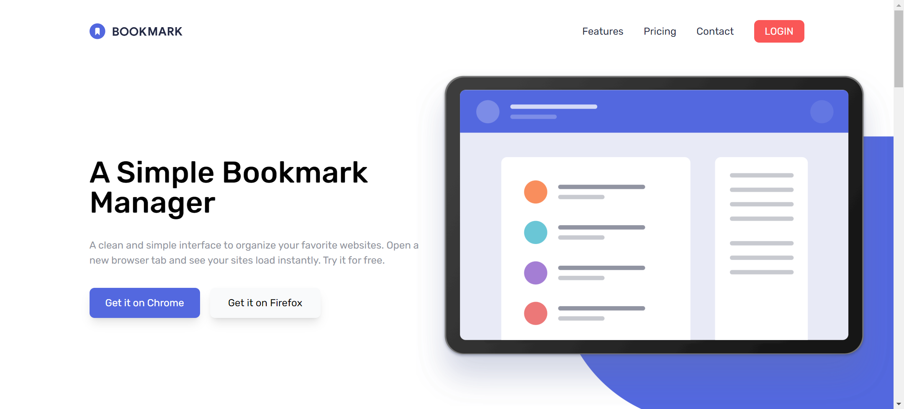

# Frontend Mentor - Bookmark landing page solution

This is a solution to the [Bookmark landing page challenge on Frontend Mentor](https://www.frontendmentor.io/challenges/bookmark-landing-page-5d0b588a9edda32581d29158). Frontend Mentor challenges help you improve your coding skills by building realistic projects. 

## Table of contents

- [Frontend Mentor - Bookmark landing page solution](#frontend-mentor---bookmark-landing-page-solution)
  - [Table of contents](#table-of-contents)
  - [Overview](#overview)
    - [The challenge](#the-challenge)
    - [Screenshot](#screenshot)
    - [Links](#links)
  - [My process](#my-process)
    - [Built with](#built-with)
    - [What I learned](#what-i-learned)
    - [Continued development](#continued-development)
    - [Useful resources](#useful-resources)
  - [Author](#author)

**Note: Delete this note and update the table of contents based on what sections you keep.**

## Overview

### The challenge

Users should be able to:

- View the optimal layout for the site depending on their device's screen size
- See hover states for all interactive elements on the page
- Receive an error message when the newsletter form is submitted if:
  - The input field is empty
  - The email address is not formatted correctly

### Screenshot

### Links

- Solution URL: [Github](https://github.com/mostafa-meerzad/bookmark-landing-page.git)
- Live Site URL: [Netlify](https://651feccd9290f31be6afe1d9--venerable-truffle-808fa6.netlify.app/)

## My process

### Built with

- Semantic HTML5 markup
- tailwindcss
- Mobile-first workflow
- [React](https://reactjs.org/) - JS library
- [Tailwindcss](https://tailwindcss.com/) - For styles

### What I learned

* Using tailwindcss to style a website
* Using custom styles with tailwindcss
* organizing my project-file structure

### Continued development

I am planning on using an animation-library like Framer-motion or GSAP for micro-interactions and animating elements whithin tailwindcss to make even more attractive websites and web apps

### Useful resources

- [TailwindCss Docs](https://tailwindcss.com/docs/installation) - This helped me to figure out utility-classes that I had no idea what they were and what they were used for.

## Author

- Github - [mostafa-meerzad](https://github.com/mostafa-meerzad)
- Frontend Mentor - [mostafa-meerzad](https://www.frontendmentor.io/profile/mostafa-meerzad)
- Linkedin - [mostafa-meerzad](https://www.linkedin.com/in/mostafa-meerzad-a753371b7)
